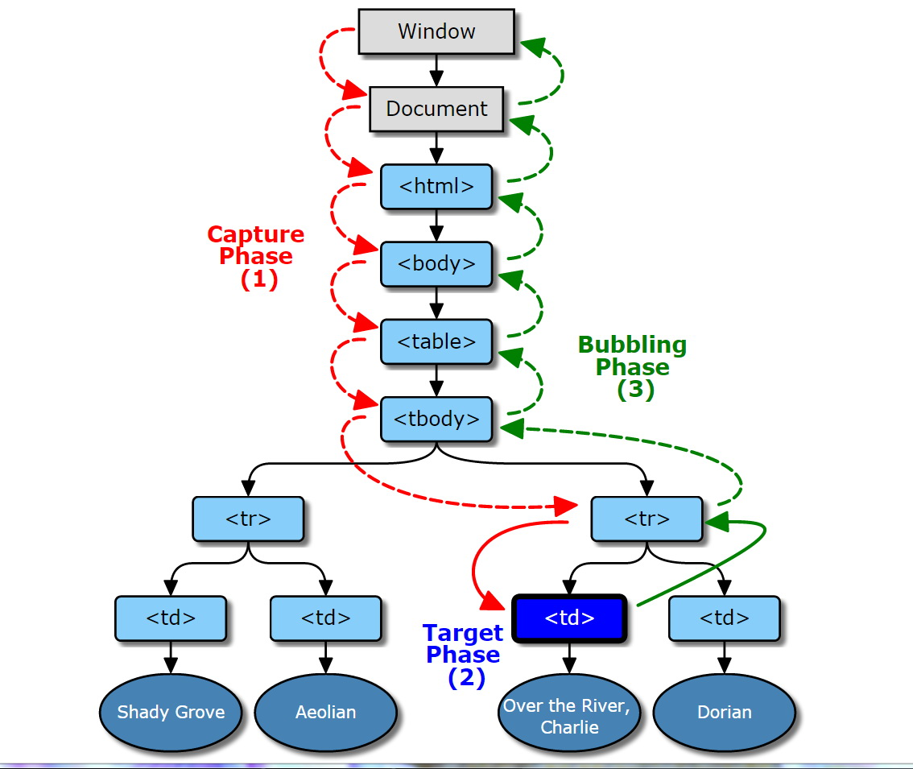

## JS基础知识

### JS作用域

JavaScript的作用域仅存在于函数范围中。

C语言和Java语言，作用域是`block-level scope`的，块级作用域。花括号就是一个作用域。

JavaScript语言，作用域是`function-level scope`的，比如if语句就不是一个作用域。

```js
var x = 1;
console.log("x=" + x);//1
if(true) {
    var x = 2;
    console.log("x=" + x); //2
}
console.log("x=" + x);
```

在JavaScript中，需要实现`block-level scope`，就是通过自执行函数创建临时作用域：

```js
var x = 1;
console.log("x=" + x);//1
if(true) {
    (function foo() {
        var x = 2;
        console.log("x=" + x); //2
    }());
}
console.log("x=" + x); //1
```

### 函数被提升

函数的声明方式主要有两种：声明式和变量式；

> 声明式会自动将声明式放在前面并且执行赋值过程。

```js
function test() {
    bar(); 
    function bar() {  //function declaration, 
        console.log("this will run?");
    }
}
test();
```

```js
function test() {
    foo();
    var foo = function() { //function express assigned to local variable 'foo'
        console.log("this will run?");
    }
}
test();
```

> 带有命名的函数变量式声明，是不会提升到作用域范围内。
```js
var bar = function foo() {
    console.log("foo run");
}

bar();
foo(); //ReferenceError "foo is not defined"
```
## 变量对象

### 基本类型
js 五种基本类型：number，string，boolean，undefined，null;

五种基本类型保存在内存的栈中，大小固定，复制其变量时会创建这个值的副本。使用typeof区分，这些值是在底层上直接实现的，不是Object，没有原型，没有构造函数。

### 引用类型
引用类型的值是对象，则保存在堆内存中。引用类型的变量实际上是一个指针，它保存在栈中，指向堆内存中的对象，复制引用类型变量实际是复制该指针，用instanceof区分。

### typeof 返回值
用来检测一个对象是否已经定义或者是否已经赋值。

typeof 实际返回类型只有六种：

- string
- number
- boolean
- undefined
- object
- function

> 检测一个对象的类型，强烈推荐使用Object.prototype.toString方法；typeof的一些返回值在标准文档中并未定义。
> typeof 适用于检测基本类型(primitive types)，Object 类型检测使用Object.prototype.toString；

### instanceof 操作符
用来比较两个操作符的构造函数。只是在比较自定义的对象时，才有意义。

如果用来比较内置类型，将会和`typeof`操作符一样用处不大。

#### JavaScript中的undefined和not define的区别：

JS中，未声明的变量会直接抛出异常 var {name} is not defined，如果没有处理异常，代码就会停止运行。

声明未赋值的变量会是undefined，但是不会抛出异常。

## JS事件机制

### 事件监听函数
`addEventListener`: 添加监听；`removeEventListener`: 移除监听；
尽量配对使用，防止事件未释放导致节点无法释放；

### 事件触发过程



捕获阶段 Capture Phase：
---
事件从window出发，不断经过下级节点到达目标节点的过程。

所有经过的节点，都会触发这个事件。捕获阶段的任务就是建立这个事件的传递路线，以便后面冒泡阶段顺着路线返回。

目标阶段 Target Phase：
---
事件到达目标节点，触发事件；

冒泡阶段 Bubbling Phase:
---
当事件到达目标节点后，就会沿着原路返回，这个过程类似水泡从底部浮到顶部，称作冒泡阶段。

[详细描述三个阶段的demo](https://codepen.io/Littlegrace111/pen/jYqNXQ)

<p data-height="265" data-theme-id="0" data-slug-hash="jYqNXQ" data-default-tab="js,result" data-user="Littlegrace111" data-embed-version="2" data-pen-title="event capture & bubble demo" class="codepen">See the Pen <a href="https://codepen.io/Littlegrace111/pen/jYqNXQ/">event capture & bubble demo</a> by Grace Wu (<a href="https://codepen.io/Littlegrace111">@Littlegrace111</a>) on <a href="https://codepen.io">CodePen</a>.</p>
<script async src="https://production-assets.codepen.io/assets/embed/ei.js"></script>

为什么要在冒泡阶段监听事件：
---
使用addEventListener函数来监听事件，第三个参数设置为false，这样监听事件时只会监听冒泡阶段发生的事件。
因为ie浏览器不支持在捕获阶段监听事件。

使用事件代理（Event Delegate）提升性能：
---
因为事件冒泡机制，所有子节点的事件都会顺着父节点冒泡回去，所以可以通过监听父节点来实现子节点监听功能，这就是事件代理。

事件代理的优势:
---
> 1. 减少事件绑定，提升性能。无须绑定一堆子节点，只需要绑定某个父节点即可。减少了绑定事件监听函数的数量；

> 2. 动态变化的DOM结构，仍然可以监听。当一个DOM动态创建后，不会带有任何事件监听，除非重新执行事件监听函数，
而使用事件代理无须担忧这个问题。

两个重要的事件函数：
---
preventDefault(function)： 禁止元素的默认行为；

stopPropagation(function):  阻止事件冒泡；


### 浏览器常用事件
`load`：资源加载完成时触发：资源包括图片，css，js文件，video，document等；

`DOMContentLoaded`：dom构建完毕的时候触发；

``


